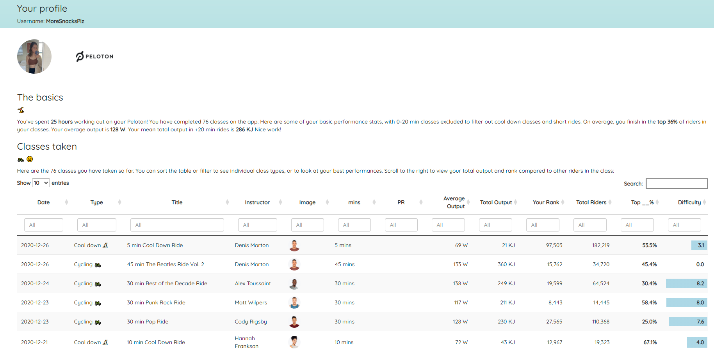
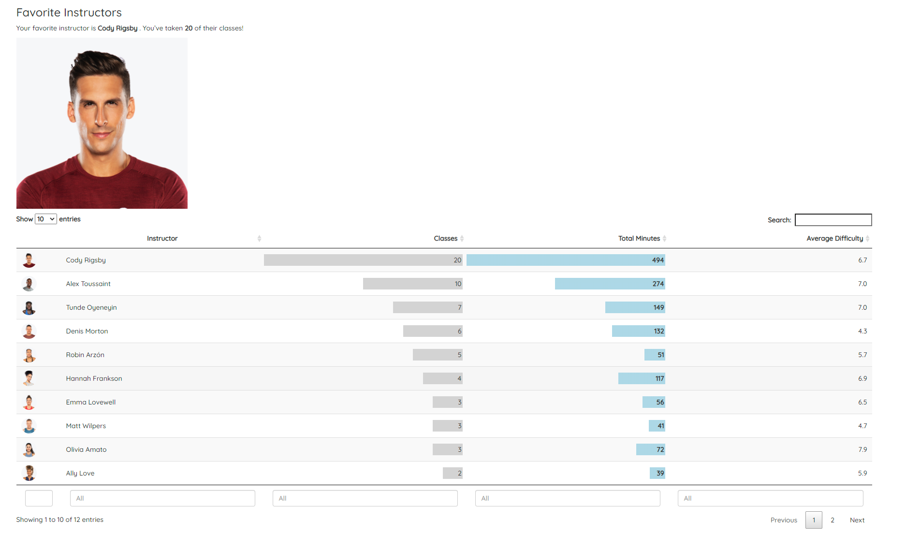
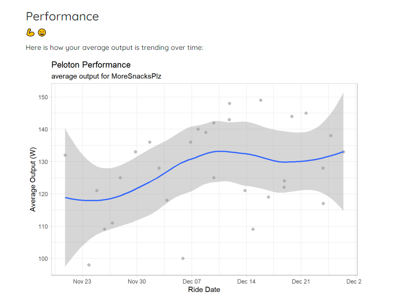
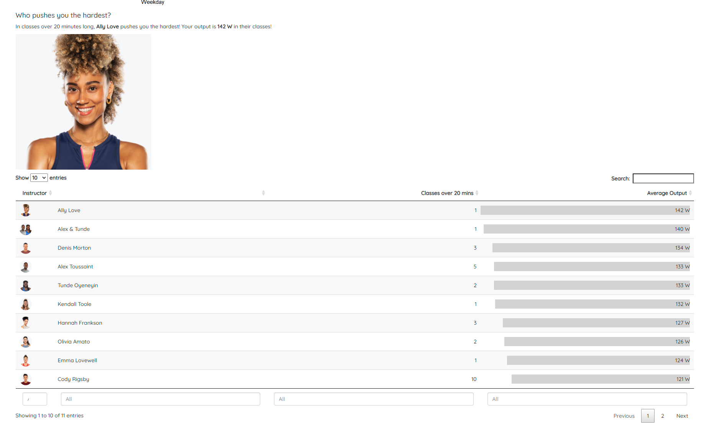
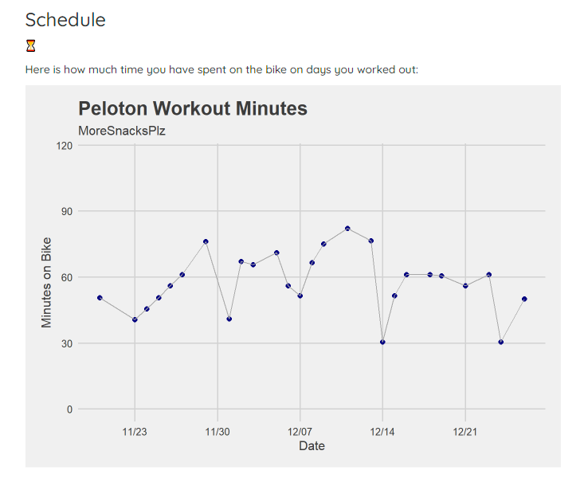

# pelotonPerformance

### Christian Dittmeier

See [full example of the output for rider MoreSnacksPlz here](https://cdittmeier.github.io/pelotonPerformance/moresnacksplz)

Shiny app version [here]( https://streamftrs.shinyapps.io/pelotonApp)

#### Generating Peloton Report Cards in R

This project uses the [pelotonR package by bweiher](https://github.com/bweiher/pelotonR) with rmarkdown to generate a performance report using Peloton credentials. 

Checkout [the documentation for the pelotonR package by bweiher for more information](https://github.com/bweiher/pelotonR)

### The report output

#### Basic summary

#### Favorite instructor

#### Performance

#### Best motivator

#### Workout time

