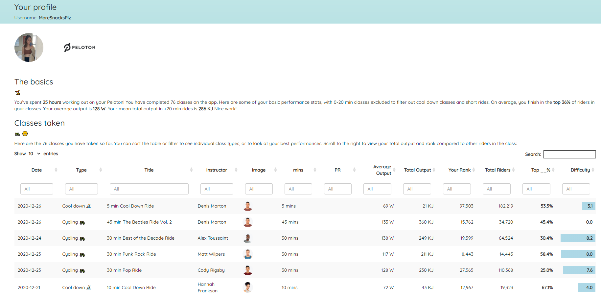
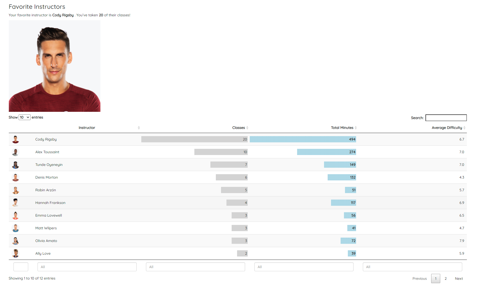
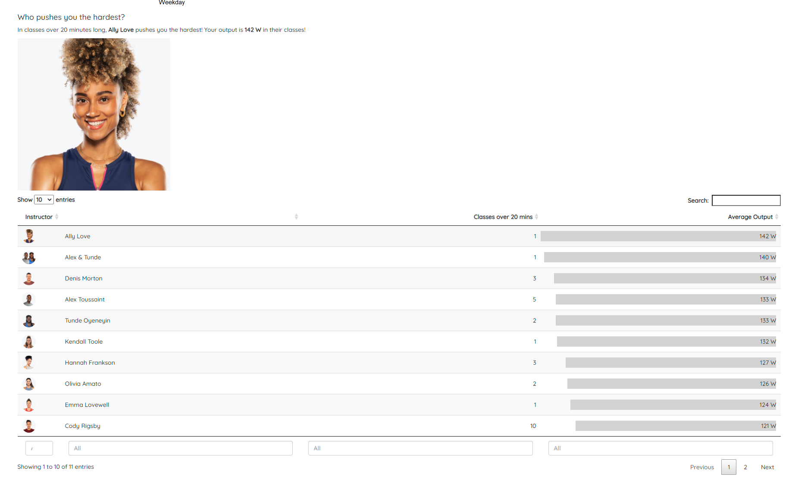
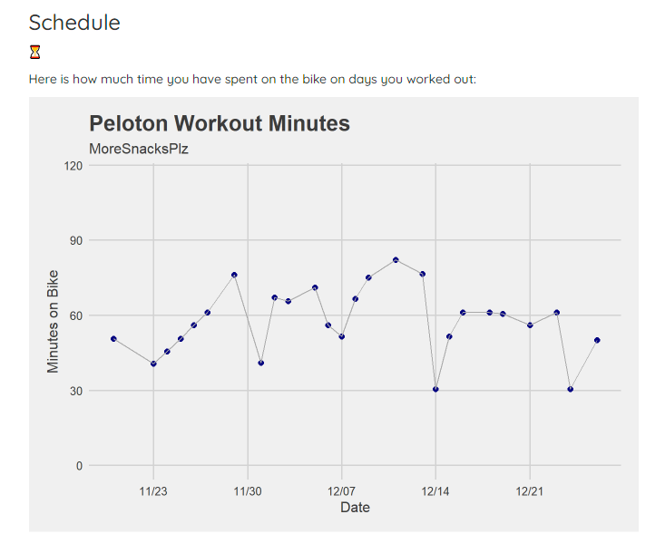

# pelotonPerformance

### Christian Dittmeier

This project uses the [pelotonr package by bweiher](https://github.com/bweiher/pelotonR) with rmarkdown to generate a performance report using Peloton credentials. In the future, it would likely be better to use the "download workouts" output from the peloton website in order to make the report accessible. 

See [full example of the output for rider MoreSnacksPlz here](https://cdittmeier.github.io/pelotonPerformance/moresnacksplz)

### The report

#### Basic summary

#### Favorite instructor

#### Performance

#### Best motivator

#### Workout time

